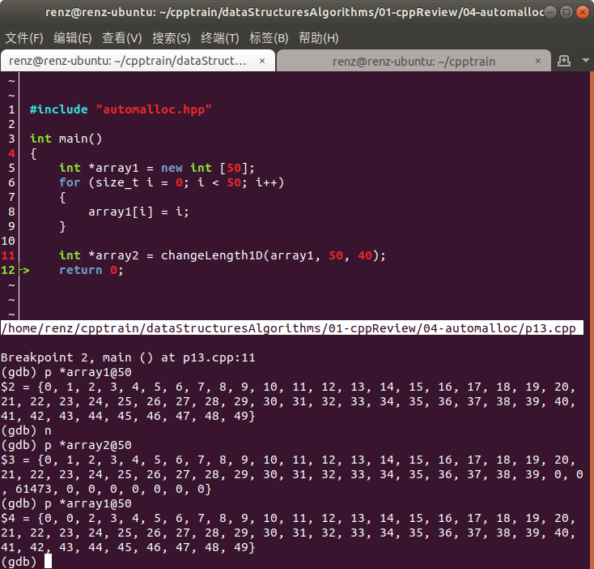

#### 12. 为程序 make2dArray （程序 1-11）编写一个通用型算法，它的第三个参数不是整数 numberOfColumns，而是一维数组rowSize。它创建一个二维数组，第 i 行的列数是 rowSize[i]。

程序：

```c++
template <class T>
bool make2dArray(T ** &x, int numberOfRows, T rowSize[])
{
    try
    {
        //创建行指针
        x = new T * [numberOfRows];

        //为第 i 行分配 rowSize[i] 个空间
        for (size_t i = 0; i < numberOfRows; ++i)
        {
            x[i] = new T [rowSize[i]];
        }
        return true;
    }
    catch(bad_alloc)
    {
        return false;
    }
}
```

编译：

```
g++ -o p12.out p12.cpp -std=c11 -g -O0
```

测试程序：

```c++
int main()
{
    int **x;
    int r = 3;
    int *c = new int[r + 1];
    for (int i = 0; i < r + 1; ++i)
    {
        c[i] = i;
    }

    make2dArray(x, r, c);
    
    return 0;
}
```

#### 13. 编写一个模板函数 changeLength1D，它将一个一维数组的长度从 oldLength 变为 newLength。函数首先分配一个新的 newLength 的数组，然后把原数组的前 min{oldLength, newLength} 个元素复制到新数组中，最后释放原数组所占用的空间。测试你的代码。

代码：

```c++
template<class T>
T* changeLength1D(T * &x, int oldLength, int newLength)
{
    //分配 newLength 的数组
    T *n = new T [newLength];
    //复制元素到新数组
    newLength = newLength <= oldLength ? newLength:oldLength;
    for (size_t i = 0; i < newLength; ++i)
    {
        n[i] = x[i];
    }
    //释放原数组占用空间
    delete [ ] x;
    return n;
}
```

编译：

```
g++ -o p13.out p13.cpp -std=c11 -g -O0
```

测试：

```c++
int main()
{
    int *array1 = new int [50];
    for (size_t i = 0; i < 50; i++)
    {
        array1[i] = i;
    }
    
    int *array2 = changeLength1D(array1, 50, 40);
    return 0;
}
```

gdb调试如下图：



#### 14. 编写一个函数 changeLength2D，它改变一个二维数组的大小（见练习13）。测试你的代码。